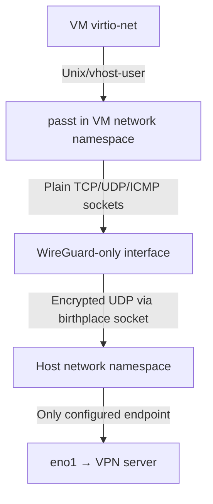

5: wg-hermes: <POINTOPOINT,NOARP,UP,LOWER_UP> mtu 1420 qdisc noqueue state UNKNOWN group default qlen 1000
link/none
inet 10.67.69.2/24 scope global wg-hermes
valid_lft forever preferred_lft forever

[root@host-r14-pods-gui-su:/ssd/vm]# cat wg-hermes.conf
[Interface]
PrivateKey = ***
Address = 10.67.69.2/24
Table = off

[Peer]
PublicKey = ***
Endpoint = ***
#AllowedIPs = 10.67.69.1/32
AllowedIPs = 0.0.0.0/0
PersistentKeepalive = 25

i have VM that

<interface type="user">
<source dev="wg-hermes"/>
<model type="virtio"/>
<driver iommu="on"/>
<rom enabled="no"/>
<address type="pci" domain="0x0000" bus="0x04" slot="0x00" function="0x0"/>
<backend type="passt"/>
<portForward proto="tcp">
<range start="2222" to="22"/>
</portForward>
<portForward proto="tcp">
<range start="3000" to="3000"/>
</portForward>
<portForward proto="tcp">
<range start="8000" to="8000"/>
</portForward>
</interface>

but when i connect to some ip from inside of vm, it goes through my eno1 not from VPN


[root@vm-r14-nvda-pods:~]# ip a
1: lo: <LOOPBACK,UP,LOWER_UP> mtu 65536 qdisc noqueue state UNKNOWN group default qlen 1000
link/loopback 00:00:00:00:00:00 brd 00:00:00:00:00:00
inet 127.0.0.1/8 scope host lo
valid_lft forever preferred_lft forever
inet6 ::1/128 scope host noprefixroute
valid_lft forever preferred_lft forever
2: enp4s0: <BROADCAST,MULTICAST,UP,LOWER_UP> mtu 1500 qdisc fq_codel state UP group default qlen 1000
link/ether 52:54:00:b0:77:77 brd ff:ff:ff:ff:ff:ff
altname enx525400b07777
inet 10.67.69.2/24 scope global enp4s0
valid_lft forever preferred_lft forever
inet6 fe80::5054:ff:feb0:7777/64 scope link proto kernel_ll
valid_lft forever preferred_lft forever

---------------------

I’m checking the exact libvirt/passt semantics here. The duplicate `10.67.69.2` on both the host’s WireGuard interface and the guest NIC is already suspicious: `passt` is user-space forwarding, not attachment of the VM directly to `wg-hermes`.

---------------------

The cause is now clear: libvirt maps `<source dev="wg-hermes"/>` to passt’s interface-selection behavior for deriving the guest’s address/routes. It does not bind passt’s outbound sockets to that interface. With `Table = off`, the host’s normal default route remains `eno1`, so passt’s proxied sockets follow it.

---------------------

`<source dev="wg-hermes"/>` does not force passt’s outgoing sockets through WireGuard.

Libvirt currently translates it to:

```text
passt --interface wg-hermes
```

That option only derives the guest addressing/routes from `wg-hermes`. Outbound sockets still follow the host routing table—which points to `eno1` because `Table = off`. Current libvirt source confirms it only emits `--interface`, while passt requires `--outbound-if4` to bind outbound IPv4 sockets. [libvirt passt documentation](https://libvirt.org/formatdomain.html#userspace-connection-using-passt), [libvirt implementation](https://sources.debian.org/src/libvirt/12.6.0-1/src/qemu/qemu_passt.c/#L100), [passt options](https://passt.top/builds/latest/web/passt.1.html)

Verify:

```bash
ps -wwC passt -o pid,user,args
ip route get 1.1.1.1
```

You should see `--interface wg-hermes`, no `--outbound-if4`, and the route via `eno1`.

### VM-only solution while retaining passt

First install an alternative, high-metric route so interface-bound sockets can route through WireGuard without changing ordinary host traffic:

```bash
ip route add default dev wg-hermes metric 50000

ip route show default
curl -4 --interface wg-hermes https://ifconfig.co
```

Your ordinary `eno1` default must have a lower metric.

Then arrange for libvirt’s passt invocation to include:

```text
--outbound-if4 wg-hermes
```

Libvirt XML currently has no knob for this. The practical workaround is a conditional `passt` wrapper earlier in the `virtqemud`/`libvirtd` service’s `PATH`:

```sh
#!/bin/sh

real=/absolute/path/to/the/real/passt
previous=

for argument; do
if [ "$previous" = "--interface" ] &&
[ "$argument" = "wg-hermes" ]; then
exec "$real" --outbound-if4 wg-hermes "$@"
fi
previous=$argument
done

exec "$real" "$@"
```

Restart `virtqemud`/`libvirtd`, then fully stop and start the VM. Confirm the new passt command with `ps`.

For persistence in `wg-hermes.conf`:

```ini
PostUp = ip route add default dev %i metric 50000
PreDown = ip route del default dev %i metric 50000
```

### Simpler, but host-wide

Remove `Table = off` or use:

```ini
Table = auto
```

That sends host traffic through WireGuard too, not merely this VM.

The duplicate `10.67.69.2` in host and guest is normal for passt’s proxy model. Also, `eno1` will still carry encrypted UDP to `1***:2026`; that is correct. It is only a leak if the clear destination IP itself appears on `eno1`.

One unrelated security footgun: your `portForward` entries have no `address`, so passt listens on all applicable host addresses. Add `address="127.0.0.1"` if they should be local-only.

---------------------

Let me describe what I'm building

I want VM to be unable to create packets via my host physical link except to my VPN endpoint

I want all traffic on VM to go through VPN, better to be able to determine only 10 subnet traffic or all but enforcement on VPN server is also ok but less preferred

I want to be able to spawn different VMs with different networking options: no, private inet via VPN, all inet via VPN

Therefore options that mess up a host are less preferred but as middle ground separation via one vm per user is fine

I want as simple as possible but working system, I want it fail close rather than fail open

Please evaluate all combinations of network backends, w/wo satellite VMs, vsock, nftables rules and ip route both to setup and for enforce invariant, with termination in and out of VM

Having termination happen inside vm if only root user can change + ip:port enforcement outside may be fine but not ideal

Please iterate over all combinations and evaluate do they match requirements, how complex and how fragile they are

---------------------

You’ve clarified the real invariant: routing preference is insufficient. The design must make cleartext guest egress to `eno1` impossible even after route loss or guest-root compromise, while allowing only WireGuard’s outer packets to reach the physical NIC.

I’m treating guest root as potentially hostile and the host/VPN gateway as trusted. I’ll separate structural guarantees (no path exists) from firewall guarantees (a path exists but is denied), because that distinction decides both fragility and fail-closed behavior.

---------------------

The strongest candidate is emerging: put only the network backend—not the host or necessarily QEMU—inside a WireGuard-only network namespace. WireGuard can be created in the host namespace and moved into the restricted namespace while its encrypted UDP socket remains in the host namespace. That gives a structural kill switch: the backend literally cannot see `eno1`; only ciphertext can leave through WireGuard’s host-side socket. [WireGuard documents this namespace “birthplace” property explicitly](https://www.wireguard.com/netns/).

I’m checking the libvirt integration variants now, especially external passt/vhost-user versus per-user session daemons, and then I’ll rank those against the simpler TAP+nft and satellite-VM designs.

---------------------

The best fit is:

1. **No-network VM:** no NIC at all; use virtio-console or a narrowly scoped vsock service for management.
2. **VPN-private / VPN-all:** put an externally managed `passt` process inside a per-VM WireGuard-only network namespace, connect it to libvirt using generic vhost-user.
3. **Fallback if external vhost-user is annoying:** isolated TAP/libvirt bridges, host-side WireGuard termination, policy routing by ingress bridge, and an independent nftables kill switch.

A satellite router VM works, but a network namespace gives almost the same security boundary with less machinery. Guest-terminated WireGuard is simpler still, but cannot enforce “only `10/8` inside the tunnel” against guest root unless the VPN server enforces it.

## Security model

Assumptions:

- Guest root may be hostile.
- Host root, libvirt configuration and VPN endpoint are trusted.
- Escaping QEMU/KVM is out of scope.
- The VPN endpoint has a fixed numeric IP and UDP port.
- IPv6 is either fully covered by equivalent policy or explicitly dropped.

The invariant should be:

> A protected VM can cause either no physical egress, or WireGuard ciphertext to the configured VPN endpoint. It cannot send cleartext to `eno1`, directly or through a host service.

That final sentence matters. If the guest can call a host DNS resolver, HTTP proxy or other service that subsequently uses `eno1`, it has created a confused-deputy leak even though its own packet never traversed `FORWARD`.

## Fundamental rules

- Routing is path selection, not an ACL.
- An empty policy-routing table normally falls through to the next RPDB rule, often `main`. Add a terminal `unreachable` route/rule.
- nftables should independently drop any packet from a protected source whose egress is not the expected WG interface.
- With TAP/bridge networking, guest traffic is forwarded and enforcement belongs in `FORWARD`.
- With passt/slirp, guest traffic becomes locally generated host sockets; enforcement belongs in `OUTPUT`, matched by UID/cgroup/namespace.
- A WireGuard-only namespace is stronger than either: the physical interface does not exist there, so there is no fallback path.

Linux supports `iif`, `uidrange`, fwmarks and terminal failure actions in policy routing. An `unreachable` route produces a hard failure, whereas a missing route can allow lookup to continue. [ip-rule(8)](https://www.man7.org/linux/man-pages/man8/ip-rule.8.html), [ip-route(8)](https://www.man7.org/linux/man-pages/man8/ip-route.8.html)

## Termination location

| WG termination | Guest root can alter tunnel | Outside-guest destination/port policy | Cleartext visible on host | Verdict |
|---|---:|---:|---:|---|
| Inside workload VM | Yes | Only endpoint ACL locally; inner policy requires VPN server | Only on VM virtual link before encryption | Simplest, weaker policy |
| Host initial namespace | No | Easy with nftables | Yes | Good standard design |
| Dedicated host netns | No | Easy inside namespace | Yes, but confined | Best overall |
| Satellite/router VM | No, assuming router VM trusted | Enforced in router VM and/or server | On private virtual bridge | Strong but heavier |
| VPN server only | Guest can bypass tunnel locally | Server sees only tunneled traffic | Possibly | Does not satisfy invariant |

## Backend × termination matrix

| Backend | WG in workload | WG on host | WG-only netns | Satellite WG |
|---|---|---|---|---|
| No NIC + vsock | Standard WG impossible; needs proxy | Host proxy possible | Excellent for SOCKS/explicit proxy | Requires host relay |
| Isolated TAP/bridge | Good with endpoint-only underlay ACL | Good | Excellent, full IP | Natural choice |
| passt / vhost-user passt | Possible but needs UID/cgroup endpoint ACL | Possible, identity-based | Excellent | No useful advantage |
| QEMU SLIRP | Possible, but QEMU identity must be isolated | Possible, awkward | Works if entire QEMU runs in namespace | Dominated |
| macvtap/direct/physical bridge | Unsafe without upstream hardware ACL | Host cannot reliably interpose | Defeats namespace isolation | Unsafe uplink |
| SR-IOV/PCI VF | Unsafe without NIC/switch ACL | Host nft cannot enforce | Not applicable | Only with hardware ACL |

`type='user'` passt versus vhost-user passt does not materially change the security path. Vhost-user is faster and lets you connect to an externally launched process; it is not itself an isolation mechanism. Generic vhost-user uses a Unix control socket and shared-memory data plane. [libvirt vhost-user documentation](https://libvirt.org/formatdomain.html#vhost-user-connection), [QEMU vhost-user protocol](https://www.qemu.org/docs/master/interop/vhost-user.html)

## Option A: WG-only namespace + external passt

This is my preferred design for your case.



WireGuard has a particularly useful namespace property: create the interface in namespace A, move it to namespace B, and its encrypted UDP socket remains in A. Namespace B can contain only `lo` and WireGuard; cleartext cannot reach a physical NIC because none exists there. [Official WireGuard namespace documentation](https://www.wireguard.com/netns/)

Conceptual setup:

```bash
ip netns add vpn-vm42
ip -n vpn-vm42 link set lo up

# Created in host namespace: encrypted UDP socket is born here.
ip link add wg-vm42 type wireguard
ip link set wg-vm42 netns vpn-vm42

ip -n vpn-vm42 addr add 10.67.69.42/32 dev wg-vm42
ip netns exec vpn-vm42 wg setconf wg-vm42 /etc/wireguard/vm42.conf
ip -n vpn-vm42 link set wg-vm42 up
```

For `vpn-all`:

```bash
ip -n vpn-vm42 route add default dev wg-vm42 metric 100
ip -n vpn-vm42 route add unreachable default metric 32760
```

For `vpn-private`:

```bash
ip -n vpn-vm42 route add 10.0.0.0/8 dev wg-vm42
ip -n vpn-vm42 route add unreachable default metric 32760
```

The unreachable default is important: if the WG route disappears, the lookup terminates instead of finding some future fallback interface.

Run passt inside the namespace:

```bash
ip netns exec vpn-vm42 \
passt --foreground \
--vhost-user \
--socket /run/passt/vm42.sock \
--interface wg-vm42 \
--outbound-if4 wg-vm42
```

Connect libvirt to the externally managed process:

```xml
<memoryBacking>
<source type="memfd"/>
<access mode="shared"/>
</memoryBacking>

<devices>
<interface type="vhostuser">
<source type="unix"
path="/run/passt/vm42.sock"
mode="client">
<reconnect enabled="yes" timeout="5"/>
</source>
<model type="virtio"/>
</interface>
</devices>
```

Do not include `<backend type="passt"/>` here: that tells libvirt to launch passt itself in the host namespace. Generic `type="vhostuser"` connects to your external process. Current libvirt supports external Unix-socket vhost-user, while passt supports vhost-user operation. [libvirt documentation](https://libvirt.org/formatdomain.html#vhost-user-connection-with-passt-backend)

Operational complications:

- Shared memory is required for vhost-user; `memfd` is the clean choice.
- Socket ownership and AppArmor/SELinux labels may need configuration.
- Current libvirt passt vhost-user support is single-queue.
- Passt handles TCP, UDP and ICMP, not arbitrary IP protocols or full L2.
- For full-IP behavior, run QEMU/TAP inside the namespace instead of passt. That is more integration work.

### Enforcement in the namespace

For private mode, route restriction plus WG `AllowedIPs=10.0.0.0/8` gives two layers. Add nftables if you want destination/port policy:

```nft
table inet vm_policy {
chain output {
type filter hook output priority filter; policy drop;

oifname "lo" accept
ct state established,related accept

oifname "wg-vm42" ip daddr 10.0.0.0/8 \
tcp dport { 22, 443 } accept
oifname "wg-vm42" ip daddr 10.0.0.0/8 \
udp dport 53 accept
}
}
```

For all-internet mode, allow `oifname "wg-vm42"` broadly, possibly retaining explicit blocked networks.

Because this namespace has no physical interface, even an nft mistake sends excess traffic through WG, not `eno1`. That is a useful distinction: firewall failure may broaden tunneled access but does not create a cleartext leak.

### Restrict the outer socket

Give each WG interface a unique `FwMark`, then enforce on the host that marked outer packets can only target the configured endpoint:

```nft
table inet wg_outer_guard {
chain output {
type filter hook output priority -150; policy accept;

meta mark 0x6942 ip daddr 1*** \
udp dport 2026 accept
meta mark 0x6942 drop
}
}
```

Only trusted host code can configure the WG interface or mark. The guest cannot generate host-namespace packets with that mark.

### Inbound connections

For remote access, configure passt’s `--tcp-ports`/`--udp-ports` inside the namespace and allow the source/port in namespace nftables. Those listeners are reachable through WG, not `eno1`.

For host-local management, use:

- virtio-console;
- QEMU guest agent over virtio-serial;
- a narrowly scoped vsock SSH/agent service.

Avoid adding a general-purpose host↔namespace veth solely for management: it reintroduces a potential bypass path.

### Assessment

- Guarantee: structural.
- Complexity: 3/5.
- Runtime fragility: 2/5.
- Host route disruption: essentially none.
- Best for: TCP/UDP/ICMP workloads and your existing passt model.

## Option B: isolated TAP bridge + host WG + PBR + nftables

This is the cleanest conventional libvirt setup and supports full IP semantics.

Create separate stable libvirt networks/bridges:

- `virbr-vpn-private`
- `virbr-vpn-all`

Use:

```xml
<forward mode="nat" dev="wg-hermes"/>
```

Libvirt documents that specifying `dev` restricts forwarding to the named device. NAT or route mode still uses the host routing stack, so you must add policy routing to actually select WG. [libvirt network forwarding](https://libvirt.org/formatnetwork.html#connectivity)

Example routing:

```bash
ip rule add pref 1000 iif virbr-vpn-all lookup 200
ip route add table 200 default dev wg-hermes metric 100
ip route add table 200 unreachable default metric 32760

ip rule add pref 1010 iif virbr-vpn-private lookup 201
ip route add table 201 10.0.0.0/8 dev wg-hermes
ip route add table 201 unreachable default metric 32760
```

Matching by ingress bridge is better than source-address-only routing: guest root can spoof its IP, but cannot change which host TAP/bridge its packets arrive through.

Add an independent early nftables denial chain:

```nft
table inet vm_killswitch {
chain forward_guard {
type filter hook forward priority -10; policy accept;

iifname "virbr-vpn-all" oifname != "wg-hermes" drop

iifname "virbr-vpn-private" oifname != "wg-hermes" drop
iifname "virbr-vpn-private" ip daddr != 10.0.0.0/8 drop
iifname "virbr-vpn-private" meta nfproto ipv6 drop

# No direct new ingress from the physical side.
oifname "virbr-vpn-all" iifname != "wg-hermes" \
ct state new drop
oifname "virbr-vpn-private" iifname != "wg-hermes" \
ct state new drop
}
}
```

The exact observed `iifname` can depend on bridge hook placement. Validate with `nft monitor trace`; nftables also exposes bridge-master metadata through `ibrname`/`obrname`. It supports stable name and wildcard matching for dynamically created TAP devices. [nftables meta expressions](https://netfilter.org/projects/nftables/manpage.html)

Also:

- Drop guest→host `INPUT`, except minimal DHCP if needed.
- Do not expose a host DNS resolver unless its upstream is itself guaranteed to use WG.
- Use static guest addressing or DHCP without host-recursive DNS.
- Add bridge-family filtering or libvirt port isolation if guests must not communicate laterally.
- Mirror every policy for IPv6, or drop IPv6 at the bridge.
- Install the unreachable routes and nft guard before starting any VM.

### NAT versus routed mode

| Mode | Advantage | Cost |
|---|---|---|
| NAT to host WG address | Simplest server configuration | Server loses per-VM source identity |
| Routed guest subnet through WG | Server sees individual VM addresses; better auditing and policy | Server needs return routes and peer `AllowedIPs` |
| One WG interface/key per VM | Strongest identity and server policy | More interfaces and key lifecycle |
| Shared WG interface | Simpler | Host must enforce all per-VM distinctions |

If VPN-server enforcement matters, routed per-VM subnets or separate WG peers are preferable. WireGuard `AllowedIPs` on the server validates/routs peer source addresses; use server nftables to restrict the peer’s destination networks and ports.

### Assessment

- Guarantee: two independent host controls—terminal routing plus nft kill switch.
- Complexity: 3/5.
- Runtime fragility: 2–3/5.
- Host disruption: custom tables/rules only; main default route unchanged.
- Best for: full IP networking and ordinary libvirt management.

## Option C: WireGuard inside the workload VM

Give the VM an underlay NIC on a dedicated bridge. Host nftables allows exactly:

```text
VM TAP → 1***:2026/UDP
```

and drops everything else, including host/LAN access. NAT that outer UDP flow to `eno1`.

This provides an excellent cleartext-leak invariant:

- WG working: inner traffic is encrypted.
- WG down: only packets to the endpoint remain possible.
- Guest changes its physical default route: non-endpoint traffic is dropped.
- Guest sends IPv6: dropped.
- Guest changes its source IP/MAC: match the host TAP/bridge, not source address.

However, host nftables cannot inspect destinations inside the tunnel. A hostile guest root can change client `AllowedIPs` from `10/8` to `0/0`. Therefore:

- `all via VPN`: locally enforceable.
- `only 10/8 via VPN`: must be enforced by VPN-server firewall if guest root is hostile.
- IP/port policy: must be in guest or VPN server.
- Keys live in the workload and can be stolen by guest root.

This is probably the simplest acceptable option if guest root is trusted or server enforcement is acceptable.

### Assessment

- Guarantee against cleartext leak: strong.
- Guarantee of `10/8`-only tunnel use: weak locally.
- Complexity: 2/5.
- Runtime fragility: 2/5.
- Inbound: naturally arrives through the guest’s WG peer.

## Option D: satellite/router VM

Topology:

```text
workload VM ── private bridge ── router VM ── endpoint-only underlay
│
WireGuard
```

The workload has no underlay NIC. The router VM has:

- one workload-facing private NIC;
- one host-enforced endpoint-only NIC;
- WireGuard;
- routing/NAT and nftables.

This is strong because workload root cannot alter the router’s policy. A shared router can classify workloads by interface, VLAN or subnet and provide:

- no network;
- only `10/8`;
- all through WG;
- per-VM ingress and egress ports.

Requirements:

- The host must enforce endpoint-only traffic on the router’s underlay TAP.
- Workloads must not be connected to that underlay bridge.
- Shared workload bridges need port isolation to prevent lateral bypass.
- Router VM root becomes trusted infrastructure.
- Boot ordering and router availability become dependencies.

Per-workload satellite VMs give excellent blast-radius isolation but double the VM count. A shared satellite is more efficient but compromise affects all attached workloads.

A host network namespace is effectively a much lighter satellite using the already-trusted host kernel. I would only choose the VM variant if you explicitly want the routing implementation isolated from the host kernel/network configuration or want a separately maintained network appliance.

### Assessment

- Guarantee: strong.
- Complexity: 4/5.
- Runtime fragility: 3/5.
- Full IP: yes.
- Local policy outside workload: yes.

## Option E: passt/slirp in host namespace, isolated by UID

This is the reasonable middle ground you mentioned.

Run each VM/session—or preferably only its external passt process—as a dedicated Unix UID. Then:

```bash
ip rule add pref 1100 uidrange 12342-12342 lookup 242
ip route add table 242 default dev wg-hermes metric 100
ip route add table 242 unreachable default metric 32760
```

And nftables:

```nft
meta skuid 12342 oifname != "wg-hermes" drop
```

For private mode, additionally drop destinations outside `10/8`.

The kernel supports `uidrange` for locally generated routing, and nftables exposes `skuid`. nftables can also match cgroup v2 socket ancestry. [ip-rule UID selection](https://www.man7.org/linux/man-pages/man8/ip-rule.8.html), [nftables socket/cgroup expressions](https://netfilter.org/projects/nftables/manpage.html)

Advantages:

- Host default route remains unchanged.
- Clear separation per UID.
- Works with passt/slirp’s locally generated sockets.
- Terminal unreachable route plus nft guard gives two layers.

Problems:

- All processes under that UID receive the same policy.
- QEMU migration/display/helper sockets can be affected.
- Verify which UID passt actually drops to.
- Passt’s default host/gateway mappings can expose host services, creating confused-deputy paths.
- Cgroup-based marking is more precise but more dynamic and complex.
- Libvirt-managed passt is placed in the VM cgroup, but routing has no direct cgroup selector; nft must mark socket traffic and RPDB must route by mark.
- SLIRP is built into QEMU, so its network identity is the entire QEMU process.

Dedicated UID is less fragile than cgroup matching. A WG-only namespace is stronger than both.

### Assessment

- Dedicated UID: complexity 3/5, fragility 3/5.
- Cgroup/socket marking: complexity 4/5, fragility 4/5.
- `--outbound-if4` alone: insufficient as an invariant.
- Default `<source dev="wg-hermes"/>`: does not meet the requirement.

## Option F: no NIC + vsock proxy

Vsock is a host/guest socket transport, not an IP network. Libvirt assigns the guest a CID; applications communicate by CID and port. [libvirt vsock](https://libvirt.org/formatdomain.html#vsock), [vsock(7)](https://www.man7.org/linux/man-pages/man7/vsock.7.html)

A strong design is:

```text
VM without NIC → vsock SOCKS/HTTP proxy → proxy in WG-only netns
```

Advantages:

- Structural no-leak guarantee.
- Very small exposed interface.
- Easy per-destination and per-port enforcement.
- Inbound access is necessarily explicit.
- Good for SSH, Git, package access and HTTP workloads.

Limitations:

- Applications must support a proxy.
- DNS handling must be deliberate.
- UDP support is inconsistent.
- ICMP and arbitrary IP protocols do not work.
- Transparent operation needs guest TUN plus `tun2socks` or a custom IP-over-vsock tunnel.
- An IP-over-vsock tunnel largely reinvents virtio-net/passt and will be more fragile.

Vsock is excellent for management or a deliberately proxy-only VM. It is not the best general network backend.

Also, standard virtio-vsock is primarily guest↔host. Guest↔satellite-vm communication would require a host relay; a private virtio-net link is simpler.

## Designs I would reject

| Design | Reason |
|---|---|
| `Table=off` plus `<source dev="wg-hermes"/>` | Passt sockets still follow host routing |
| `--outbound-if4` without nft/namespace/terminal routing | Preference/binding, not a complete invariant |
| Default libvirt NAT network | Follows whatever host route exists |
| Source-based policy routing only | Guest can spoof source; empty table may fall through |
| `AllowedIPs` only | Does not prevent an alternative underlay route |
| VPN-server enforcement only | Server never sees bypass traffic |
| macvtap/direct/host bridge to `eno1` | Guest gets a direct physical data path |
| SR-IOV/VF | Host nft generally cannot interpose; requires hardware/switch ACL |
| libvirt `nwfilter` alone | Useful defense-in-depth for TAP, but not structural and irrelevant to passt sockets |
| Host DNS/proxy exposed to protected VM | Confused-deputy physical egress |
| Unrestricted passt `portForward` | Can create direct `eno1` ingress paths |
| Ignoring IPv6 | Common accidental bypass |

Macvtap and direct bridge modes intentionally attach the guest to the physical network with few or no restrictions, which is the opposite of the desired invariant. [libvirt direct-interface documentation](https://libvirt.org/formatdomain.html#direct-attachment-to-physical-interface)

## Final ranking

| Architecture | Guarantee | Complexity | Fragility | Recommendation |
|---|---:|---:|---:|---|
| No NIC, console only | Structural | 1 | 1 | Best “no network” |
| WG-only netns + external passt/vhost-user | Structural | 3 | 2 | Best general fit |
| WG-only netns + TAP/QEMU in namespace | Structural | 4 | 2 | Best full-IP fit |
| Host WG + isolated bridge + PBR + nft | Dual enforcement | 3 | 2–3 | Best conventional libvirt fit |
| Guest WG + endpoint-only underlay | Strong outer ACL | 2 | 2 | Best simple option |
| Satellite WG router | Strong separation | 4 | 3 | Use when router-VM boundary is valuable |
| Dedicated UID + passt | Identity-based | 3 | 3 | Acceptable middle ground |
| Cgroup-marked passt | Identity-based | 4 | 4 | Only if UID separation is unsuitable |
| Vsock proxy | Structural, proxy-only | 2–4 | 2–4 | Niche but excellent for managed workloads |
| SLIRP | Identity-based | 3 | 4 | Dominated by passt |
| macvtap/SR-IOV | No host guarantee | — | — | Reject |

## What I would actually deploy

- `none`: no `<interface>`; virtio-console, optionally one authenticated vsock management service.
- `vpn-private`: per-VM WG-only netns, external passt, only `10/8` route, terminal unreachable default, namespace nft destination/port ACL.
- `vpn-all`: same, but default route through WG.
- Unique WG key/interface/netns per VM when VPN-server identity or inbound policy matters.
- Host nft guard keyed by each WG interface’s outer `FwMark`, permitting only its endpoint.
- Remote ingress through WG and passt port forwarding inside the namespace.
- No host-recursive DNS, no unrestricted host gateway mapping, and no IPv6 unless explicitly implemented.
- systemd ordering: namespace, terminal route and outer guard must exist before passt/VM starts.

This gives you a safe failure mode: if WG, passt, routing or the VPN server disappears, connectivity stops. There is no route that silently becomes `eno1`.
